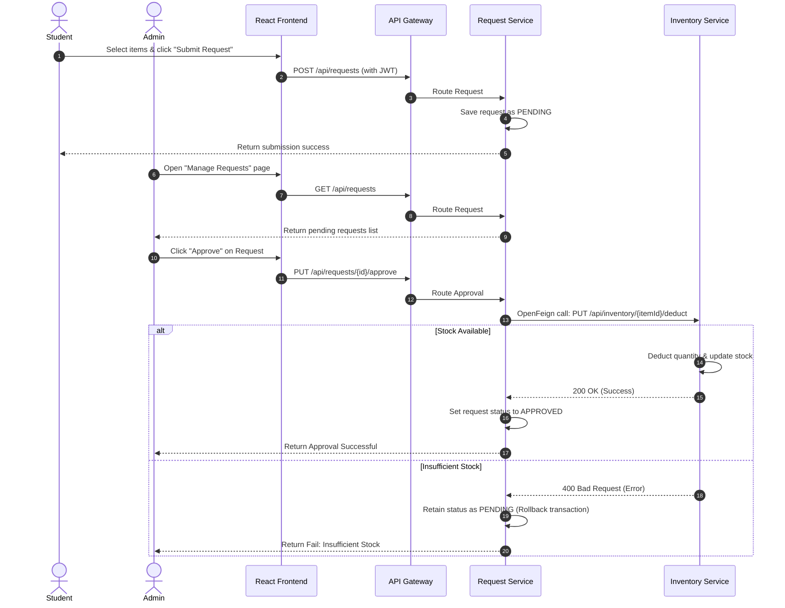
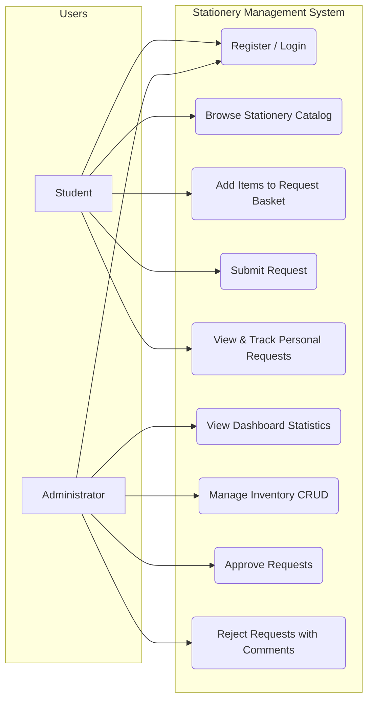

# Stationery Management System (SMS) — Developer Documentation

This document describes the design, architecture, database schemas, API endpoints, and UI styling implementation for the Stationery Management System (SMS).

---

## 1. System Architecture

SMS is built using a microservices architecture pattern, consisting of three functional business microservices and three supporting infrastructure components.

### Component Map

* **eureka-server**: Service discovery registry. All microservices register their network location here to allow dynamic lookups.
* **config-server**: Centralized configurations server. Services retrieve their runtime parameters from local property sheets (or GitHub in production environments).
* **api-gateway**: The single entrypoint for the UI client. Handles authorization (JWT verification) and routes downstream requests based on URI prefixes.
* **auth-service**: Processes registration, login validation, and generates JWT tokens.
* **inventory-service**: Manages catalog items, stock quantities, and low-stock thresholds.
* **request-service**: Handles student requests and orchestrates stock deduction by communicating with the inventory service.
* **frontend**: Nginx web server hosting the React client application.

### Inter-Service Communication
The Request Service uses **Spring Cloud OpenFeign** to interact with the Inventory Service during the approval flow.
When an administrator approves a stationery request, the Request Service calls the `PUT /api/inventory/{id}/deduct` endpoint of the Inventory Service to deduct the requested quantities from the available stock. If the stock deduction is successful, the request status is updated to `APPROVED`. If the Inventory Service returns an error (e.g., insufficient stock), the transaction rollback occurs, and the request remains `PENDING`.



### Use Cases & Role Responsibilities

The following chart outlines student and administrator capabilities within the portal:



---

## 2. Security and Authentication Flow

SMS utilizes stateless JWT (JSON Web Token) authentication to secure endpoints.

1. **User Authentication**: The client submits user credentials to the Auth Service via `POST /api/auth/login`.
2. **JWT Issuance**: Upon successful authentication, the Auth Service issues a JWT containing user claims (User ID, Email, Role).
3. **Gateway Inspection**: For subsequent requests, the React client attaches the token in the `Authorization: Bearer <token>` HTTP header. The API Gateway intercepts this request:
   - It extracts and parses the token.
   - It verifies the signature and expiration using a shared secret.
   - It forwards the user details (role and ID) as downstream HTTP headers to ensure security context propagation.
4. **Role-Based Access Control (RBAC)**: Custom filters verify if the user's role (`STUDENT` or `ADMIN`) allows them to perform the requested operation. For example, endpoints under `/api/inventory` that modify items require the `ADMIN` role.

---

## 3. Database Schema

The system uses three separate MySQL databases (`auth_db`, `inventory_db`, and `request_db`) to enforce database-per-service isolation.

### Auth Database (auth_db)

#### Table: `users`
Stores user profile information and credentials.
* `id` (BIGINT, Primary Key, Auto-Increment)
* `email` (VARCHAR(255), Unique, Not Null)
* `password` (VARCHAR(255), Not Null) — BCrypt-hashed password
* `full_name` (VARCHAR(150), Not Null)
* `role` (VARCHAR(10), Not Null) — Enum: `STUDENT`, `ADMIN`
* `created_at` (DATETIME, Not Null)
* `updated_at` (DATETIME, Not Null)

---

### Inventory Database (inventory_db)

#### Table: `stationery_items`
Holds the record of available stationery items.
* `id` (BIGINT, Primary Key, Auto-Increment)
* `name` (VARCHAR(200), Not Null)
* `category` (VARCHAR(20), Not Null) — Enum: `PAPER`, `PEN`, `PENCIL`, `NOTEBOOK`, `ERASER`, `OTHER`
* `unit` (VARCHAR(50), Nullable) — e.g. "Pack", "Piece"
* `available_quantity` (INT, Not Null, Default: 0)
* `minimum_quantity` (INT, Nullable) — The safety stock threshold below which low-stock alerts trigger
* `created_at` (DATETIME, Not Null)
* `updated_at` (DATETIME, Not Null)

---

### Request Database (request_db)

#### Table: `stationery_requests`
Maintains the metadata of student stationery requests.
* `id` (BIGINT, Primary Key, Auto-Increment)
* `student_id` (BIGINT, Not Null)
* `student_email` (VARCHAR(255), Not Null)
* `status` (VARCHAR(20), Not Null) — Enum: `PENDING`, `APPROVED`, `REJECTED`, `FULFILLED`
* `admin_comment` (TEXT, Nullable) — Reason for rejection or admin feedback
* `request_date` (DATETIME, Not Null)
* `updated_at` (DATETIME, Not Null)

#### Table: `request_items`
Contains the individual line items inside a stationery request.
* `id` (BIGINT, Primary Key, Auto-Increment)
* `request_id` (BIGINT, Foreign Key referencing `stationery_requests.id`, Not Null)
* `item_id` (BIGINT, Not Null) — Reference to `stationery_items.id` in `inventory_db` (logical constraint only, no physical FK)
* `item_name` (VARCHAR(200), Not Null) — Denormalized item name snapshotted at request time to avoid synchronous join dependencies
* `quantity` (INT, Not Null)

---

## 4. API Endpoints Reference

### Authentication Service (`/api/auth`)

#### Register User
* **Method**: `POST`
* **Path**: `/api/auth/register`
* **Payload**:
  ```json
  {
    "email": "student@college.edu",
    "password": "securepassword123",
    "fullName": "Jane Doe",
    "role": "STUDENT"
  }
  ```
* **Response (201 Created)**:
  ```json
  {
    "id": 5,
    "email": "student@college.edu",
    "fullName": "Jane Doe",
    "role": "STUDENT"
  }
  ```

#### Authenticate & Login
* **Method**: `POST`
* **Path**: `/api/auth/login`
* **Payload**:
  ```json
  {
    "email": "student@college.edu",
    "password": "securepassword123"
  }
  ```
* **Response (200 OK)**:
  ```json
  {
    "token": "eyJhbGciOiJIUzI1NiIsInR5cCI6IkpXVCJ9...",
    "email": "student@college.edu",
    "fullName": "Jane Doe",
    "role": "STUDENT"
  }
  ```

---

### Inventory Service (`/api/inventory`)

#### List Items (Paginated)
* **Method**: `GET`
* **Path**: `/api/inventory`
* **Query Parameters**:
  - `page` (int, default: 0)
  - `size` (int, default: 8)
  - `category` (string, optional) — Filter by Enum values (e.g. `PEN`)
* **Response (200 OK)**:
  ```json
  {
    "content": [
      {
        "id": 1,
        "name": "Gel Pen Blue",
        "category": "PEN",
        "unit": "Piece",
        "availableQuantity": 150,
        "minimumQuantity": 20
      }
    ],
    "totalPages": 1,
    "totalElements": 1,
    "size": 8,
    "number": 0
  }
  ```

#### Add Inventory Item (Admin Only)
* **Method**: `POST`
* **Path**: `/api/inventory`
* **Headers**: `Authorization: Bearer <JWT>`
* **Payload**:
  ```json
  {
    "name": "A4 Notepad",
    "category": "PAPER",
    "unit": "Pack",
    "availableQuantity": 100,
    "minimumQuantity": 10
  }
  ```
* **Response (201 Created)**:
  ```json
  {
    "id": 12,
    "name": "A4 Notepad",
    "category": "PAPER",
    "unit": "Pack",
    "availableQuantity": 100,
    "minimumQuantity": 10
  }
  ```

---

### Request Service (`/api/requests`)

#### Submit Request (Student Only)
* **Method**: `POST`
* **Path**: `/api/requests`
* **Headers**: `Authorization: Bearer <JWT>`
* **Payload**:
  ```json
  {
    "items": [
      {
        "itemId": 1,
        "quantity": 5
      },
      {
        "itemId": 12,
        "quantity": 2
      }
    ]
  }
  ```
* **Response (201 Created)**:
  ```json
  {
    "id": 42,
    "studentEmail": "student@college.edu",
    "status": "PENDING",
    "items": [
      {
        "id": 80,
        "itemId": 1,
        "itemName": "Gel Pen Blue",
        "quantity": 5
      },
      {
        "id": 81,
        "itemId": 12,
        "itemName": "A4 Notepad",
        "quantity": 2
      }
    ],
    "requestDate": "2026-06-19T03:15:00"
  }
  ```

#### Approve Request (Admin Only)
* **Method**: `PUT`
* **Path**: `/api/requests/{id}/approve`
* **Headers**: `Authorization: Bearer <JWT>`
* **Response (200 OK)**:
  ```json
  {
    "id": 42,
    "status": "APPROVED",
    "adminComment": null
  }
  ```

#### Reject Request (Admin Only)
* **Method**: `PUT`
* **Path**: `/api/requests/{id}/reject`
* **Headers**: `Authorization: Bearer <JWT>`
* **Payload**:
  ```json
  {
    "adminComment": "Exceeds daily request allowance for writing utensils."
  }
  ```
* **Response (200 OK)**:
  ```json
  {
    "id": 42,
    "status": "REJECTED",
    "adminComment": "Exceeds daily request allowance for writing utensils."
  }
  ```

---

## 5. UI Theme Design: Claymorphism

The system's user interface is styled using Claymorphism principles. It provides a tactile, soft, and soothing environment compared to traditional sharp flat UI designs.

### Core Visual Rules

1. **Pastel Gradients**: The screen base utilizes warm, soft-washed background colors with low-intensity radial gradients of sky blue, light purple, and mint. This prevents visual fatigue during extended admin sessions.
2. **Pillowy Cards (`.glass-card`)**: Structural containers are rounded (`border-radius: 24px`) and use multiple inner and outer shadows to achieve a soft 3D extruded appearance:
   - **Outer Shadow**: Soft, spread-out shadow (`rgba(166, 180, 200, 0.22)`) simulating direct downward light.
   - **Top-Left Inner Highlight**: White highlight (`rgba(255, 255, 255, 0.9)`) simulating the edge glare on clay/plastic material.
   - **Bottom-Right Inner Shadow**: Soft gray shadow (`rgba(166, 180, 200, 0.08)`) simulating self-shading.
3. **Debossed Inputs (`.glass-input`)**: Form fields are styled to look sunken into the surface, using inner shadows (`inset 2px 2px 5px`) and white outer highlights to reverse the card elevation.
4. **Tactile Buttons**: Buttons are styled as bouncy clay capsules. Clicking a button translates it downwards (`translateY(1px)`) and decreases the shadows to simulate physical compression.
5. **Soothing Color Contrast**: Dark mode color tokens are intercepted in the main stylesheet (`index.css`) and mapped to soft slate text colors (`#1e293b` for titles, `#475569` for body copy) to ensure Web Content Accessibility Guidelines (WCAG) legibility requirements are satisfied on the pastel background.
