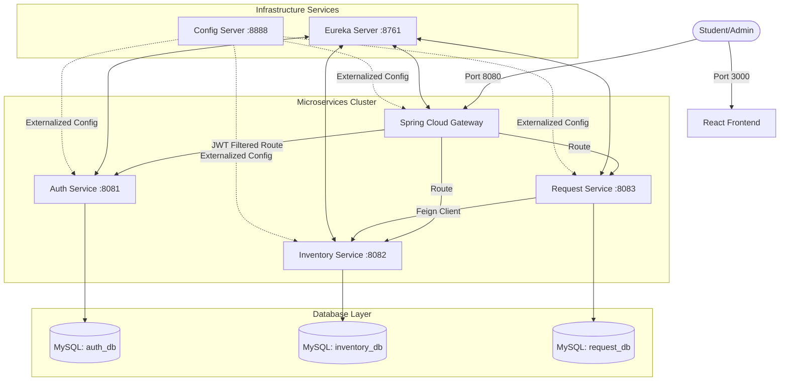
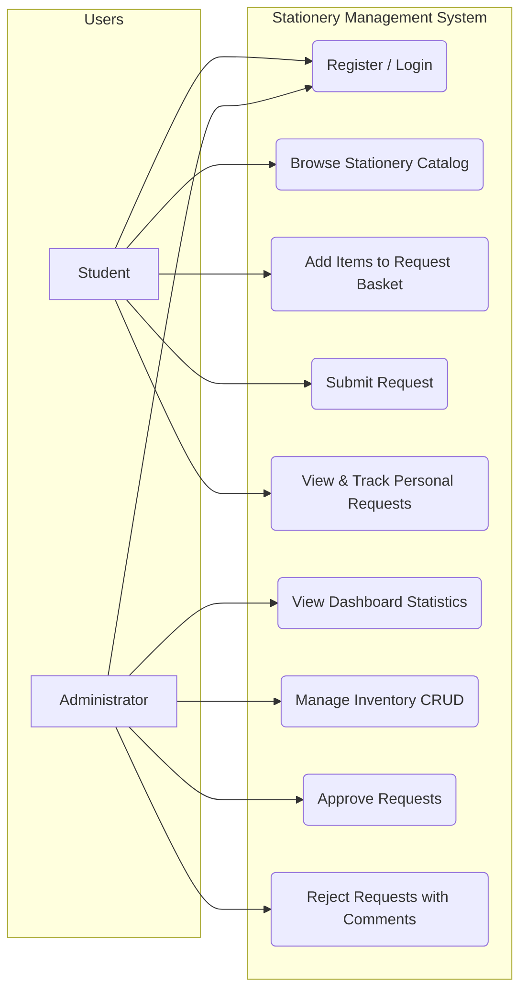
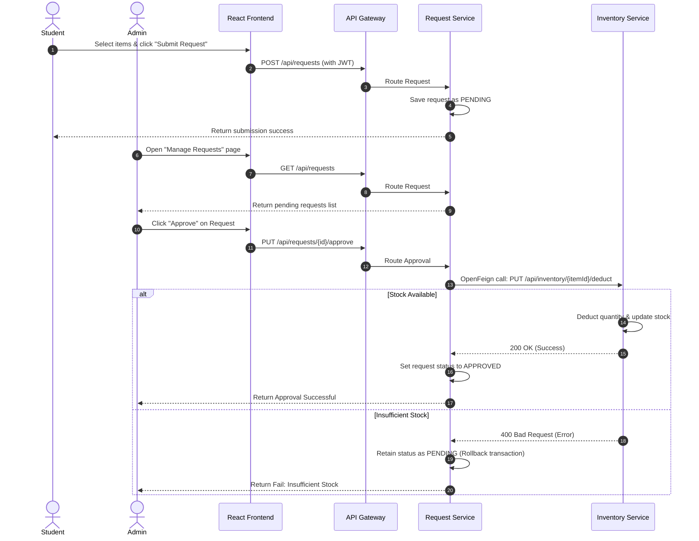

# Stationery Management System (SMS)

This repository contains the Stationery Management System, a microservices-based application designed to manage college stationery inventories and process student item requests. It consists of multiple Spring Boot backend services, a service registry, a central configuration server, an API gateway, and a React frontend.

---

## System Architecture

The application is split into decoupled microservices that communicate with each other using Spring Cloud components:



### Use Case Diagram

The following diagram maps student and administrator roles to key system actions:



### Request & Approval Process Flow

This sequence chart outlines how requests are submitted by students and how administrators approve them, triggering OpenFeign-based stock deductions:



---

## Tech Stack

* **Backend Frameworks**: Spring Boot 3.2.5, Spring Cloud 2023.0.1 (Eureka, Config Server, Gateway, OpenFeign), Spring Security, Jakarta Validation
* **Frontend**: React 19, Vite, Tailwind CSS, Axios, React Toastify
* **Styling Theme**: Claymorphic UI (featuring pastel gradients, 3D inner/outer shadows, and pillowy cards)
* **Databases & Infrastructure**: MySQL 8.0, Docker & Docker Compose, Maven
* **Quality Assurance**: JUnit 5, Mockito, JaCoCo (for test coverage reports)

---

## Port Allocation Matrix

| Service | Host Port | Context Path | Description |
| :--- | :---: | :--- | :--- |
| **Frontend Client** | `3000` | `/` | React web application (served via Nginx in Docker) |
| **API Gateway** | `8080` | `/` | System entrypoint; handles JWT validation and routing |
| **Auth Service** | `8081` | `/api/auth` | User registration, login, session checking, and JWT issuance |
| **Inventory Service** | `8082` | `/api/inventory` | Stationery database CRUD operations & stock updates |
| **Request Service** | `8083` | `/api/requests` | Student requests lifecycle & integration with Inventory service |
| **Eureka Server** | `8761` | `/` | Service discovery console and registry |
| **Config Server** | `8888` | `/` | Central repository for service configurations |
| **MySQL Database** | `3307` | N/A | Port mapped on host machine (3306 internally) |

---

## Quick Start (Docker Compose)

You can launch the complete system (including databases, services, and the web client) in a single step using Docker Compose.

### Prerequisites
* Docker Desktop installed and running.

### Execution
From the root directory of the project, run:

```bash
docker compose up --build -d
```

This command will:
1. Initialize the MySQL container and set up the default tables via the initialization script.
2. Build and launch all Spring Boot microservices.
3. Build and launch the React app inside an Nginx environment.
4. Expose the web application on `http://localhost:3000`.

To stop all services and tear down the containers:
```bash
docker compose down
```

---

## Local Development Setup

To run and debug the services individually on your machine:

### 1. Database Initialization
Ensure a MySQL server is running on port 3306 or 3307. Execute the SQL script in `init-db.sql` to initialize the database instances:
* `auth_db`
* `inventory_db`
* `request_db`

### 2. Run Backend Services
Launch the backend services sequentially in separate terminals. Start the infrastructure services first:

1. **Eureka Server**:
   ```bash
   cd eureka-server && mvn spring-boot:run
   ```
2. **Config Server**:
   ```bash
   cd config-server && mvn spring-boot:run
   ```
3. **Auth Service**:
   ```bash
   cd auth-service && mvn spring-boot:run
   ```
4. **Inventory Service**:
   ```bash
   cd inventory-service && mvn spring-boot:run
   ```
5. **Request Service**:
   ```bash
   cd request-service && mvn spring-boot:run
   ```
6. **API Gateway**:
   ```bash
   cd api-gateway && mvn spring-boot:run
   ```

### 3. Run React Frontend
Navigate to the frontend folder, install the Node packages, and launch the Vite local server:
```bash
cd frontend
npm install
npm run dev
```

The application will run locally at `http://localhost:3000`.

---

## Testing & Code Coverage

Tests are written using JUnit 5 and Mockito. The project targets high test coverage across all services.

To execute the test suites and generate coverage statistics:
```bash
mvn clean test
```

### Coverage Reports
After the tests run, you can inspect the detailed JaCoCo coverage reports locally at:
* **Auth Service**: `auth-service/target/site/jacoco/index.html`
* **Inventory Service**: `inventory-service/target/site/jacoco/index.html`
* **Request Service**: `request-service/target/site/jacoco/index.html`
